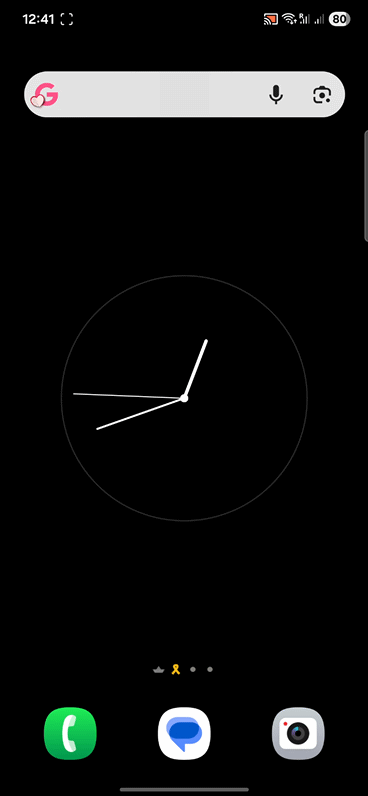
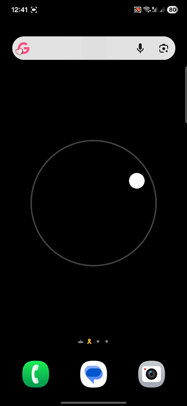

# Minimal Live Wallpapers (Android)

A small collection of clean, interactive live wallpapers built using Android’s `WallpaperService` and Canvas rendering.

## Wallpapers

### 🕒 Analog Clock
Smooth sweeping second hand with a minimal black & white design.

<!-- Add clock demo GIF below -->
<!--  -->

---

### ⚪ Gravity Ball
Accelerometer-based gravity physics with inertia and boundary bounce.

<!-- Add gravity demo GIF below -->
<!--  -->

---

## Tech Stack

- Kotlin
- Canvas + SurfaceHolder
- SensorManager (Accelerometer)
- Jetpack Compose (Material 3 UI)

---

## Usage

1. Open the app
2. Select a wallpaper
3. Set it from the system preview

Minimal. Lightweight. AMOLED-friendly.
